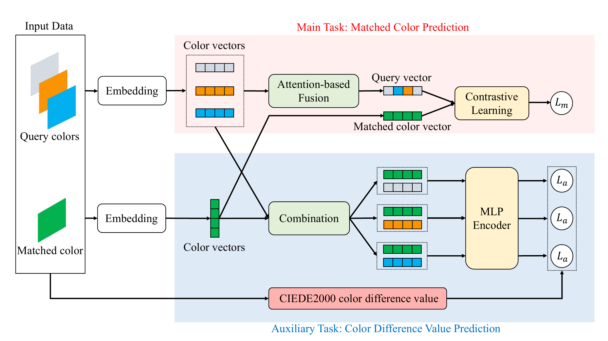

# DAColor

DAColor is a dual-task model for categorical color recommendation. This repository contains the dataset, the DAColor implementation, and the scripts required to train and run the model.



## Repository contents

- `data/data.txt`: 25,040 extracted color schemes.
- `data/colorbrewer.txt`: source RGB palette.
- `data/source_manifest.json`: dataset counts and checksums.
- `dacolor/`: data preparation, color conversion, model, training, evaluation, and inference code.

Generated datasets, checkpoints, and training outputs are excluded from Git and can be reproduced with the commands below.

## Installation

Python 3.10 or later is required.

```bash
git clone https://github.com/ws521917/DAColor.git
cd DAColor

python3 -m venv .venv
source .venv/bin/activate
pip install -e .
```

## Prepare the dataset

Create the fixed training, validation, and test split together with the palette and CIEDE2000 matrix:

```bash
python -m dacolor.prepare_data
```

The generated files are written to `data/processed_corrected/`.

## Train DAColor

Train one model on the prepared split:

```bash
python -m dacolor.train --device auto
```

`--device auto` selects CUDA when available, then Apple MPS, and otherwise CPU. The selected checkpoint and training summary are written to `outputs/dacolor_corrected/`.

## Run inference

Recommend colors from a trained checkpoint. Query colors may be canonical color IDs, palette names, hexadecimal values, or CSS color names.

```bash
python -m dacolor.infer \
  --checkpoint outputs/dacolor_corrected/best_model.pt \
  --query-colors 68 \
  --top-k 10
```

To iteratively complete a larger scheme:

```bash
python -m dacolor.infer \
  --checkpoint outputs/dacolor_corrected/best_model.pt \
  --query-colors 68 76 \
  --target-scheme-size 5 \
  --top-k 10
```
